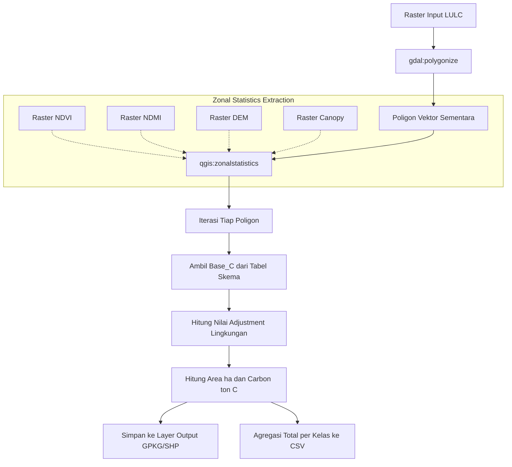
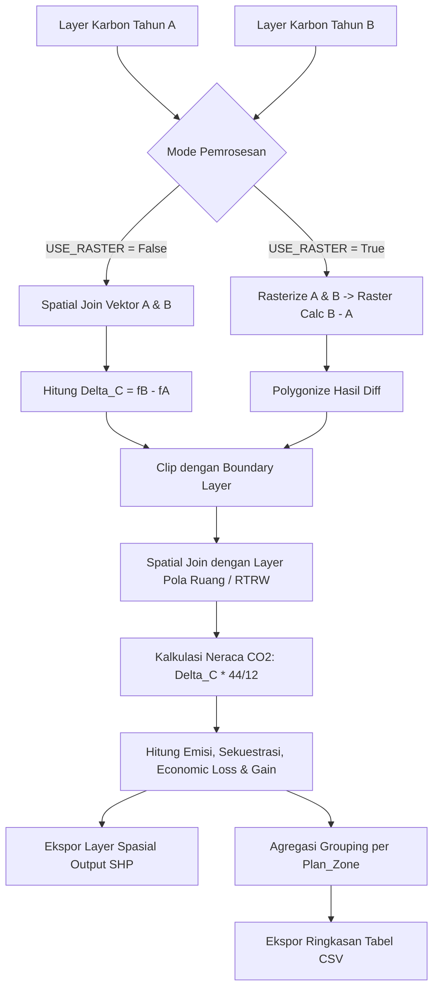

# Modul Pembelajaran: Estimasi Cadangan Karbon & Analisis Dinamika Emisi CO₂ Berbasis QGIS (SCALA 3)

Dokumen ini memuat materi komprehensif, metodologi, formulasi matematis, dan panduan teknis operasional untuk dua modul algoritma pemrosesan spasial QGIS (*PyQGIS Processing Algorithms*):
1. **`scala_carbon_stock_estimation.py`** — Algoritma Estimasi Cadangan Karbon Tutupan Lahan Multi-Indeks.
2. **`scala_carbon_stock_comparison_shp.py`** — Algoritma Analisis Dinamika Karbon, Neraca Emisi/Sekuestrasi $\text{CO}_2$, dan Valuasi Finansial Berbasis Zona Tata Ruang.

---

## Daftar Isi
1. [Pendahuluan & Konsep Dasar](#1-pendahuluan--konsep-dasar)
2. [Modul 1: Estimasi Cadangan Karbon Berbasis Raster](#2-modul-1-estimasi-cadangan-karbon-berbasis-raster)
   - [2.1 Tujuan & Fitur Utama](#21-tujuan--fitur-utama)
   - [2.2 Parameter Input & Output](#22-parameter-input--output)
   - [2.3 Nilai Dasar Karbon (Base Carbon Density)](#23-nilai-dasar-karbon-base-carbon-density)
   - [2.4 Formulasi Matematis Penyesuaian Lingkungan](#24-formulasi-matematis-penyesuaian-lingkungan)
   - [2.5 Alur Eksekusi Algoritma 1](#25-alur-eksekusi-algoritma-1)
3. [Modul 2: Komparasi Dinamika Karbon, Emisi CO₂ & Valuasi Ekonomi](#3-modul-2-komparasi-dinamika-karbon-emisi-co₂--valuasi-ekonomi)
   - [3.1 Tujuan & Fitur Utama](#31-tujuan--fitur-utama)
   - [3.2 Parameter Input & Output](#32-parameter-input--output)
   - [3.3 Metode Perhitungan Delta Karbon (Vektor vs Raster)](#33-metode-perhitungan-delta-karbon-vektor-vs-raster)
   - [3.4 Formulasi Konversi CO₂ & Neraca Emisi/Sekuestrasi](#34-formulasi-konversi-co₂--neraca-emisisekuestrasi)
   - [3.5 Valuasi Ekonomi Finansial](#35-valuasi-ekonomi-finansial)
   - [3.6 Alur Eksekusi Algoritma 2](#36-alur-eksekusi-algoritma-2)
4. [Diagram Alur Kerja Terpadu (End-to-End Workflow)](#4-diagram-alur-kerja-terpadu-end-to-end-workflow)
5. [Contoh Simulasi Perhitungan Numerik](#5-contoh-simulasi-perhitungan-numerik)
6. [Panduan Operasional di QGIS Processing Toolbox](#6-panduan-operasional-di-qgis-processing-toolbox)
7. [Kesimpulan & Batasan Model](#7-kesimpulan--batasan-model)

---

## 1. Pendahuluan & Konsep Dasar

Dalam mitigasi perubahan iklim dan tata kelola karbon (*carbon accounting*), estimasi biomassa dan cadangan karbon di atas permukaan tanah (*Above Ground Biomass/Carbon*) memegang peranan krusial. 

Pendekatan konvensional umumnya mengasumsikan nilai cadangan karbon tutupan lahan bersifat statis (*flat rate*). Namun, pada kenyataannya stok karbon sangat dipengaruhi oleh:
- **Kerapatan kanopi dan klorofil** (tercermin dari indeks vegetasi).
- **Ketersediaan air / kelembaban tajuk**.
- **Ketinggian tegakan** (*Canopy Height*).
- **Gradien topografi / elevasi** (DEM).

Paket skrip SCALA 3 mengimplementasikan pendekatan **hibrida berbasis penginderaan jauh** (*remote sensing*) dan **analisis spasial vektor-raster**, yang mampu melakukan estimasi spasial beresolusi tinggi sekaligus menganalisis dampak perubahan tutupan lahan terhadap neraca emisi $\text{CO}_2$ dan nilai ekonomi karbon per zona tata ruang (RTRW).

---

## 2. Modul 1: Estimasi Cadangan Karbon Berbasis Raster
**Nama File:** `scala_carbon_stock_estimation.py`  
**Nama Modul QGIS:** `2. Carbon Stock Estimation Raster`  
**Grup:** `SCALA 3: Mastering Carbon Stock`

### 2.1 Tujuan & Fitur Utama
Mengonversi raster klasifikasi tutupan lahan (LULC) menjadi layer poligon vektor yang memuat luas area (hektar) dan total cadangan karbon ($\text{ton C}$), dengan koreksi multi-parameter lingkungan (NDVI, NDMI, DEM, dan Canopy Height).

### 2.2 Parameter Input & Output

#### Input Parameters:
| ID Parameter | Nama Parameter | Tipe Data | Deskripsi |
|---|---|---|---|
| `SCHEMA` | *Classification Schema* | Enum | Pilihan skema LULC: `0: Dynamic World` atau `1: ESRI World Cover` |
| `INPUT_RASTER` | *Input Classified Raster* | Raster Layer | Peta tutupan lahan terklasifikasi (format integer/kode kelas) |
| `NDVI_LAYER` | *Optional NDVI Raster* | Raster Layer *(Opsional)* | Indeks vegetasi (rentang nilai -1.0 s/d 1.0) |
| `NDMI_LAYER` | *Optional NDMI Raster* | Raster Layer *(Opsional)* | Indeks kelembaban tajuk (rentang nilai -1.0 s/d 1.0) |
| `DEM_LAYER` | *Optional DEM Raster* | Raster Layer *(Opsional)* | Digital Elevation Model dalam satuan meter (mdpl) |
| `CANOPY_LAYER`| *Optional Canopy Height* | Raster Layer *(Opsional)* | Model tinggi tajuk pohon dalam satuan meter |

#### Output Destinations:
| ID Parameter | Tipe Data | Format | Deskripsi |
|---|---|---|---|
| `OUTPUT_LAYER` | File Destination | GPKG / SHP | Layer vektor poligon yang berisi atribut `class_name`, `area_ha`, dan `carbon` |
| `OUTPUT_CSV` | File Destination | CSV | Tabel rekapitulasi total area (ha) dan total stok karbon ($\text{ton C}$) per kelas |

---

### 2.3 Nilai Dasar Karbon (Base Carbon Density)

Algoritma menyediakan pemetaan nilai dasar cadangan karbon ($\text{ton C/ha}$) berdasarkan standar klasifikasi global:

#### A. Skema Google Dynamic World (`SCHEMA = 0`)
| Kode DN | Label Kelas | Base Carbon Density ($\text{ton C/ha}$) |
|:---:|---|:---:|
| `0` | Water | $0$ |
| `1` | Trees | $150$ |
| `2` | Grass | $10$ |
| `3` | Flooded Vegetation | $100$ |
| `4` | Crops | $40$ |
| `5` | Shrub and Scrub | $30$ |
| `6` | Built | $0$ |
| `7` | Bare | $1$ |
| `8` | Snow and Ice | $0$ |

#### B. Skema ESRI World Cover (`SCHEMA = 1`)
| Kode DN | Label Kelas | Base Carbon Density ($\text{ton C/ha}$) |
|:---:|---|:---:|
| `1` | Water | $0$ |
| `2` | Trees | $150$ |
| `4` | Flooded Vegetation | $100$ |
| `5` | Crops | $40$ |
| `7` | Built Area | $0$ |
| `8` | Bare Ground | $1$ |
| `9` | Snow/Ice | $0$ |
| `10`| Clouds | $0$ |
| `11`| Rangeland | $10$ |

> **Catatan Khusus pada Kelas Air:**  
> Jika kelas terdeteksi sebagai `water` namun nilai NDVI lokal $> 0.5$ atau Canopy Height $> 10\text{ m}$ (indikasi vegetasi akuatik atau mangrove yang terendam air pasang), nilai dasar dinaikkan menjadi $1.0\text{ ton C/ha}$.

---

### 2.4 Formulasi Matematis Penyesuaian Lingkungan

Untuk memperhitungkan variasi kualitas tutupan lahan di lapangan, digunakan faktor koreksi penyesuaian lingkungan (*Environmental Adjustment Factor*):

$$\text{Adjustment} = 1 + a(\text{NDVI} - \text{NDVI}_{\text{ref}}) + b(\text{Canopy} - \text{Canopy}_{\text{ref}}) + c(\text{DEM} - \text{DEM}_{\text{ref}}) + d(\text{NDMI} - \text{NDMI}_{\text{ref}})$$

#### Parameter Kalibrasi & Nilai Referensi:
| Indikator | Nilai Rata-rata ($\bar{X}$) | Nilai Referensi ($X_{\text{ref}}$) | Bobot Koefisien | Rasionalisasi Ilmiah |
|---|:---:|:---:|:---:|---|
| **NDVI** | $\text{ndvi\_mean}$ | $\text{NDVI}_{\text{ref}} = 0.5$ | $a = 0.20$ | Kerapatan klorofil berkorelasi positif dengan biomassa aktif. |
| **Canopy** | $\text{canopy\_mean}$ | $\text{Canopy}_{\text{ref}} = 10.0\text{ m}$ | $b = 0.01$ | Tinggi pohon meningkatkan volume kayu per hektar. |
| **DEM** | $\text{dem\_mean}$ | $\text{DEM}_{\text{ref}} = 100.0\text{ m}$ | $c = 0.0005$| Elevasi mempengaruhi suhu, kelembaban, dan tipe vegetasi. |
| **NDMI** | $\text{ndmi\_mean}$ | $\text{NDMI}_{\text{ref}} = 0.5$ | $d = 0.15$ | Kadar air pada tajuk mengindikasikan kesehatan tegakan. |

*Jika layer opsional tidak disediakan oleh pengguna, nilai input raster tersebut otomatis menggunakan nilai referensi ($X = X_{\text{ref}}$), sehingga selisih $(X - X_{\text{ref}}) = 0$ dan tidak mendistorsi hasil.*

#### Formula Total Cadangan Karbon:
$$\text{Area (ha)} = \frac{\text{Luas Geometri Poligon (m}^2\text{)}}{10.000}$$

$$\text{Carbon Stock (ton C)} = \text{Base\_C} \times \text{Area (ha)} \times \text{Adjustment}$$

---

### 2.5 Alur Eksekusi Algoritma 1



---

## 3. Modul 2: Komparasi Dinamika Karbon, Emisi CO₂ & Valuasi Ekonomi
**Nama File:** `scala_carbon_stock_comparison_shp.py`  
**Nama Modul QGIS:** `3. Carbon Stock Comparison & CO₂ Analysis`  
**Grup:** `SCALA 3`

### 3.1 Tujuan & Fitur Utama
Membandingkan dua periode stok karbon (Tahun A sebagai *baseline* dan Tahun B sebagai *monitoring*), menghitung selisih neto cadangan karbon ($\Delta C$), mengonversi ke setara emisi/sekuestrasi $\text{CO}_2$, serta mengaitkan hasilnya dengan batas wilayah administrasi dan pola ruang (RTRW/Zonasi) untuk valuasi finansial.

---

### 3.2 Parameter Input & Output

#### Input Parameters:
| ID Parameter | Tipe Data | Deskripsi |
|---|---|---|
| `INPUT_LAYER_A` | Vector Layer | Layer poligon stok karbon Tahun A (*baseline*) |
| `FIELD_CARBON_A`| Numeric Field | Nama field atribut nilai stok karbon Tahun A |
| `INPUT_LAYER_B` | Vector Layer | Layer poligon stok karbon Tahun B (*monitoring*) |
| `FIELD_CARBON_B`| Numeric Field | Nama field atribut nilai stok karbon Tahun B |
| `BOUNDARY_LAYER`| Polygon Layer | Batas area studi untuk proses *clipping* |
| `PLAN_LAYER` | Polygon Layer *(Opsional)* | Peta rencana tata ruang / zonasi lahan |
| `PLAN_FIELD` | Attribute Field *(Opsional)*| Kolom nama peruntukan zona tata ruang |
| `USE_RASTER` | Boolean | `False` (default, metode vektor join) atau `True` (metode raster differencing) |
| `RASTER_RESOLUTION`| Double | Resolusi piksel jika memilih metode raster (default: `30.0` meter) |
| `CARBON_PRICE` | Double | Nilai pasar kompensasi karbon dalam Rupiah (default: `30000.0` IDR/tCO₂) |

#### Output Destinations:
| ID Parameter | Tipe Data | Format | Deskripsi |
|---|---|---|---|
| `OUTPUT_SHP` | Feature Sink | Shapefile / Vektor | Layer spasial hasil kalkulasi lengkap per unit fitur poligon |
| `OUTPUT_CSV` | File Destination | CSV | Tabel rekap agregasi emisi, sekuestrasi, dan nilai moneter per zona tata ruang |

---

### 3.3 Metode Perhitungan Delta Karbon (Vektor vs Raster)

Algoritma mendukung dua opsi pemrosesan:

1. **Mode Vektor (`USE_RASTER = False` - Direkomendasikan)**:
   - Melakukan penggabungan atribut berdasarkan relasi spasial (`native:joinattributesbylocation`) antara Layer A dan Layer B.
   - Menghitung perubahan karbon secara langsung per poligon:
     $$\Delta C = \text{Carbon}_B - \text{Carbon}_A$$

2. **Mode Raster (`USE_RASTER = True`)**:
   - Me-rasterisasi Layer A dan B berdasarkan field karbon (`gdal:rasterize`) dengan ukuran piksel `RASTER_RESOLUTION`.
   - Menjalankan kalkulator raster selisih: $\text{Diff} = \text{Raster}_B - \text{Raster}_A$ (`gdal:rastercalculator`).
   - Mengonversi kembali hasil raster selisih menjadi vektor (`gdal:polygonize`) dengan field `Delta_C`.

Setelah selisih terbentuk, layer dipotong sesuai batas wilayah (`native:clip`) dan dioverlay dengan rencana tata ruang (`PLAN_LAYER`) untuk melampirkan atribut `Plan_Zone`.

---

### 3.4 Formulasi Konversi CO₂ & Neraca Emisi/Sekuestrasi

Berdasarkan stoikiometri dasar IPCC (*Intergovernmental Panel on Climate Change*), 1 atom Karbon ($\text{C}$, massa atom 12) ketika teroksidasi menghasilkan 1 molekul Karbon Dioksida ($\text{CO}_2$, massa molekul 44). Rasio konversinya adalah:

$$\text{Faktor Konversi } \text{CO}_2 = \frac{\text{BM } \text{CO}_2}{\text{BA } \text{C}} = \frac{44}{12} \approx 3.6667$$

$$\text{Net } \text{CO}_2 (\text{tCO}_2) = \Delta C \times \frac{44}{12}$$

#### Logika Penentuan Emisi vs Sekuestrasi:
- **Kondisi 1: Kehilangan Karbon / Deforestasi ($\Delta C < 0$)**
  $$\text{CO}_2\text{ Emissions (tCO}_2) = |\text{Net } \text{CO}_2|$$
  $$\text{CO}_2\text{ Sequestration (tCO}_2) = 0$$

- **Kondisi 2: Penambahan Karbon / Reforestasi ($\Delta C > 0$)**
  $$\text{CO}_2\text{ Emissions (tCO}_2) = 0$$
  $$\text{CO}_2\text{ Sequestration (tCO}_2) = \text{Net } \text{CO}_2$$

- **Kondisi 3: Tidak Ada Perubahan ($\Delta C = 0$)**
  $$\text{Emisi} = 0, \quad \text{Sekuestrasi} = 0$$

---

### 3.5 Valuasi Ekonomi Finansial

Nilai moneter dihitung berdasarkan harga pasar karbon per ton $\text{CO}_2$ ekuivalen ($\text{Carbon Price}$):

$$\text{Economic Loss (IDR)} = \text{CO}_2\text{ Emissions (tCO}_2) \times \text{Carbon Price (IDR/tCO}_2)$$

$$\text{Economic Gain (IDR)} = \text{CO}_2\text{ Sequestration (tCO}_2) \times \text{Carbon Price (IDR/tCO}_2)$$

#### Skema Atribut pada Layer Output Shapefile:
| Nama Kolom Atribut | Tipe Data | Deskripsi |
|---|---|---|
| `Feature_ID` | Integer | ID unik poligon fitur |
| `Plan_Zone` | String | Nama zona tata ruang peruntukan lahan |
| `Carbon_A_tC` | Double | Cadangan karbon pada Tahun A ($\text{ton C}$) |
| `Carbon_B_tC` | Double | Cadangan karbon pada Tahun B ($\text{ton C}$) |
| `Delta_C_tC` | Double | Perubahan neto karbon ($\Delta C = B - A$) |
| `CO2_Emissions_tCO2` | Double | Total emisi akibat degradasi/deforestasi ($\text{tCO}_2$) |
| `CO2_Sequestration_tCO2` | Double | Total penyerapan karbon baru ($\text{tCO}_2$) |
| `Economic_Loss_IDR` | Double | Kerugian valuasi ekonomi akibat emisi (Rp) |
| `Economic_Gain_IDR` | Double | Keuntungan valuasi ekonomi akibat sekuestrasi (Rp) |

---

### 3.6 Alur Eksekusi Algoritma 2



---

## 4. Diagram Alur Kerja Terpadu (End-to-End Workflow)

Berikut adalah integrasi penuh kedua skrip dalam suatu siklus analisis perubahan cadangan karbon:

```mermaid
graph TB
    subgraph Fase 1: Pemodelan Baseline & Monitoring (Script 1)
        subgraph Periode Baseline (Tahun A)
            LULC_A[Raster LULC Tahun A] --> MOD1_A[Script 1: Carbon Stock Estimation]
            ENV_A[NDVI, NDMI, DEM, Canopy A] -.-> MOD1_A
            MOD1_A --> SHP_A[(Layer Karbon Tahun A)]
            MOD1_A --> CSV_A[Summary CSV A]
        end
        
        subgraph Periode Monitoring (Tahun B)
            LULC_B[Raster LULC Tahun B] --> MOD1_B[Script 1: Carbon Stock Estimation]
            ENV_B[NDVI, NDMI, DEM, Canopy B] -.-> MOD1_B
            MOD1_B --> SHP_B[(Layer Karbon Tahun B)]
            MOD1_B --> CSV_B[Summary CSV B]
        end
    end

    subgraph Fase 2: Analisis Spasial Komparatif & Valuasi (Script 2)
        SHP_A --> MOD2[Script 2: Carbon Stock Comparison & CO2 Analysis]
        SHP_B --> MOD2
        BND[Batas Administrasi / Boundary] --> MOD2
        RTRW[Peta Pola Ruang / Zonasi RTRW] --> MOD2
        
        MOD2 --> RES_SHP[(Peta Spasial Neraca Emisi/Sekuestrasi)]
        MOD2 --> RES_CSV[Tabel Valuasi Ekonomi per Zona RTRW]
    end
```

---

## 5. Contoh Simulasi Perhitungan Numerik

### Studi Kasus: Poligon Kawasan Hutan (10 Hektar) yang Mengalami Degradasi

#### 1. Kondisi Tahun A (Hutan Sehat Primer):
- **Luas:** $10\text{ ha}$
- **Tutupan Lahan:** `Trees` ($\text{Base\_C} = 150\text{ ton C/ha}$)
- **Kondisi Lingkungan:** $\text{NDVI} = 0.75$, $\text{Canopy} = 25\text{ m}$, $\text{DEM} = 300\text{ m}$, $\text{NDMI} = 0.65$
- **Faktor Penyesuaian ($A_1$):**
  $$A_1 = 1 + 0.2(0.75 - 0.5) + 0.01(25 - 10) + 0.0005(300 - 100) + 0.15(0.65 - 0.5)$$
  $$A_1 = 1 + 0.05 + 0.15 + 0.10 + 0.0225 = 1.3225$$
- **Stok Karbon Tahun A:**
  $$\text{Carbon}_A = 150 \times 10 \times 1.3225 = 1.983,75\text{ ton C}$$

#### 2. Kondisi Tahun B (Terdegradasi Menjadi Semak Belukar / Shrub):
- **Luas:** $10\text{ ha}$
- **Tutupan Lahan:** `Shrub and Scrub` ($\text{Base\_C} = 30\text{ ton C/ha}$)
- **Kondisi Lingkungan:** $\text{NDVI} = 0.40$, $\text{Canopy} = 3\text{ m}$, $\text{DEM} = 300\text{ m}$, $\text{NDMI} = 0.35$
- **Faktor Penyesuaian ($A_2$):**
  $$A_2 = 1 + 0.2(0.40 - 0.5) + 0.01(3 - 10) + 0.0005(300 - 100) + 0.15(0.35 - 0.5)$$
  $$A_2 = 1 - 0.02 - 0.07 + 0.10 - 0.0225 = 0.9875$$
- **Stok Karbon Tahun B:**
  $$\text{Carbon}_B = 30 \times 10 \times 0.9875 = 296,25\text{ ton C}$$

#### 3. Analisis Dinamika & Valuasi (Harga Karbon = Rp 30.000 / $\text{tCO}_2$):
- **Perubahan Karbon ($\Delta C$):**
  $$\Delta C = 296,25 - 1.983,75 = -1.687,50\text{ ton C}$$
- **Total Emisi $\text{CO}_2$:**
  $$\text{Emisi } \text{CO}_2 = |-1.687,50| \times \frac{44}{12} = 1.687,50 \times 3,6667 = 6.187,50\text{ tCO}_2$$
- **Sekuestrasi $\text{CO}_2$:** $0\text{ tCO}_2$
- **Kerugian Valuasi Finansial (*Economic Loss*):**
  $$\text{Loss} = 6.187,50\text{ tCO}_2 \times \text{Rp } 30.000 = \text{Rp } 185.625.000,-$$

---

## 6. Panduan Operasional di QGIS Processing Toolbox

### A. Menambahkan Skrip ke QGIS:
1. Buka software **QGIS** (versi 3.22 LTR ke atas direkomendasikan).
2. Buka panel **Processing Toolbox** (`Ctrl + Alt + T` atau menu *Processing > Toolbox*).
3. Klik ikon **Python** pada toolbar Toolbox $\rightarrow$ pilih **Add Script to Toolbox...**.
4. Pilih file `scala_carbon_stock_estimation.py` dan `scala_carbon_stock_comparison_shp.py`.
5. Menu baru bernama **SCALA 3** / **SCALA 3: Mastering Carbon Stock** akan muncul di dalam daftar toolbox.

### B. Menjalankan Tahap 1: Estimasi Karbon:
1. Klik ganda pada algoritma **`2. Carbon Stock Estimation Raster`**.
2. Pilih skema LULC yang sesuai (*Dynamic World* atau *ESRI World Cover*).
3. Masukkan layer raster tutupan lahan pada field `Input Classified Raster`.
4. *(Opsional)* Masukkan raster NDVI, NDMI, DEM, dan Canopy Height yang telah dipersiapkan.
5. Tentukan lokasi penyimpanan file output layer vektor (format `.gpkg` atau `.shp`) dan file summary `.csv`.
6. Klik **Run**.

### C. Menjalankan Tahap 2: Analisis Komparasi & Valuasi:
1. Klik ganda pada algoritma **`3. Carbon Stock Comparison & CO₂ Analysis`**.
2. Masukkan layer vektor hasil estimasi Tahun A pada `Carbon stock – Year A` dan pilih field `carbon`.
3. Masukkan layer vektor hasil estimasi Tahun B pada `Carbon stock – Year B` dan pilih field `carbon`.
4. Masukkan layer batas area studi pada `Clipping boundary`.
5. *(Opsional)* Masukkan layer shapefile rencana tata ruang pada `Spatial plan layer` dan pilih field nama zonanya (misal: `NAMA_ZONA` atau `POLA_RUANG`).
6. Masukkan asumsi harga kompensasi karbon pada `Carbon price IDR/tCO₂` (default: Rp 30.000).
7. Tentukan file tujuan output Shapefile dan CSV agregasi.
8. Klik **Run**.

---

## 7. Kesimpulan & Batasan Model

### Keunggulan:
- **Dinamis & Terkalibrasi**: Tidak hanya mengandalkan nilai tabel statis, melainkan mengintegrasikan respon fisiologis tanaman dan faktor topografi secara kontinu.
- **Kebijakan & Perencanaan Spasial**: Mengaitkan langsung emisi dan potensi valuasi finansial dengan dokumen rencana tata ruang (RTRW/Zonasi), mempermudah pengambilan keputusan bagi pemerintah daerah/stakeholder.
- **Otomasi Penuh di Lingkungan QGIS**: Terintegrasi langsung dengan QGIS Processing Framework sehingga dapat dimasukkan ke dalam *Graphical Modeler* atau pipeline batch processing.

### Batasan & Rekomendasi Pengembangan:
1. **Koefisien Kalibrasi**: Koefisien empiris ($a=0.2, b=0.01, c=0.0005, d=0.15$) adalah model referensi kurikulum SCALA. Untuk aplikasi studi ilmiah spesifik atau sertifikasi pasar karbon (*carbon credit*), koefisien disarankan dikalibrasi ulang dengan data *ground truth* (plot ukur lapangan / NFI).
2. **Sistem Koordinat Spasial (CRS)**: Pastikan semua layer masukan menggunakan sistem koordinat proyeksi metrik (seperti UTM) agar perhitungan luas poligon (`geometry().area()`) menghasilkan nilai meter persegi yang akurat sebelum dikonversi ke hektar.
3. **Penyelarasan Grid Raster**: Jika menggunakan layer NDVI/NDMI/DEM/Canopy pendukung, pastikan resolusi dan extent telah diselaraskan (*resample/align*) agar zonal statistics berjalan optimal.

---
*Materi disiapkan untuk referensi modul pelatihan dan panduan teknis geospasial SCALA 3.*
